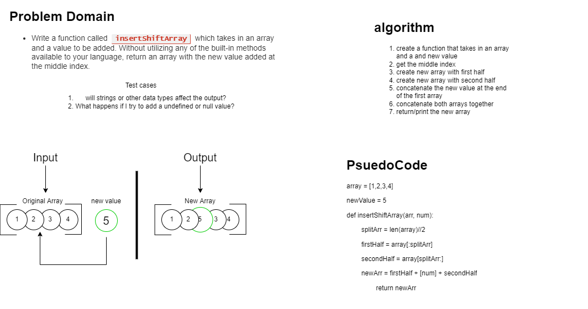

## Array-Insert-Shift
*Author: Brendon Hampton*

---

### Problem Domain
***[Problem Domain for the Code Challenge]***

Write a function called **insertShiftArray** which takes in an array and a value to be added. Without utilizing any of the built-in methods available to your language, return an array with the new value added at the middle index.

---

### Inputs and Expected Outputs

| Input | Expected Output |
| :----------- | :----------- |
| [2,4,6,-8], 5	 | [2,4,5,6,-8] |
| [42,8,15,23,42], 16 | [42,8,15,16,23,42] |

---

### Big O

| Time | Space |
| :----------- | :----------- |
| O(n) | O(n) |

---

### Whiteboard Visual
***[Your Whiteboard Image]***

---

### Change Log
***[The change log will list any changes made to the code base. This includes any changes from TA/Instructor feedback]***  
1.3: *Added new passing tests for Contains method* - 17 Nov 2012  
1.2: *Fixed bug where Next relation was being lost on Insert* - 14 Nov 2012  
1.1: *Fixed formatting for the Print method* - 13 Nov 2012  

---

For more information on Markdown: https://www.markdownguide.org/cheat-sheet