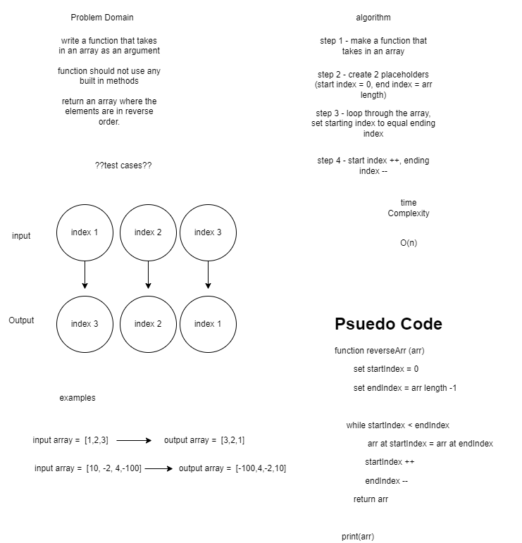

## Reverse Array
*Author: Brendon Hampton*

---

### Problem Domain
***[Problem Domain for the Code Challenge]***

Write a function called reverseArray which takes an array as an argument. Without utilizing any of the built-in methods available to your language, return an array with elements in reversed order.

---

### Inputs and Expected Outputs

| Input | Expected Output |
| :----------- | :----------- |
| [1, 2, 3, 4, 5, 6] | [6, 5, 4, 3, 2, 1] |
| [89, 2354, 3546, 23, 10, -923, 823, -12] | [-12, 823, -923, 10, 23, 3546, 2354, 89] |

---

### Big O

| Time | Space |
| :----------- | :----------- |
| O(n) | O(n) |

---

### Whiteboard Visual
***[Your Whiteboard Image]***

---

### Change Log
***[The change log will list any changes made to the code base. This includes any changes from TA/Instructor feedback]***  
1.3: *Added new passing tests for Contains method* - 17 Nov 2012  
1.2: *Fixed bug where Next relation was being lost on Insert* - 14 Nov 2012  
1.1: *Fixed formatting for the Print method* - 13 Nov 2012  

---

For more information on Markdown: https://www.markdownguide.org/cheat-sheet